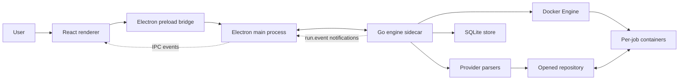
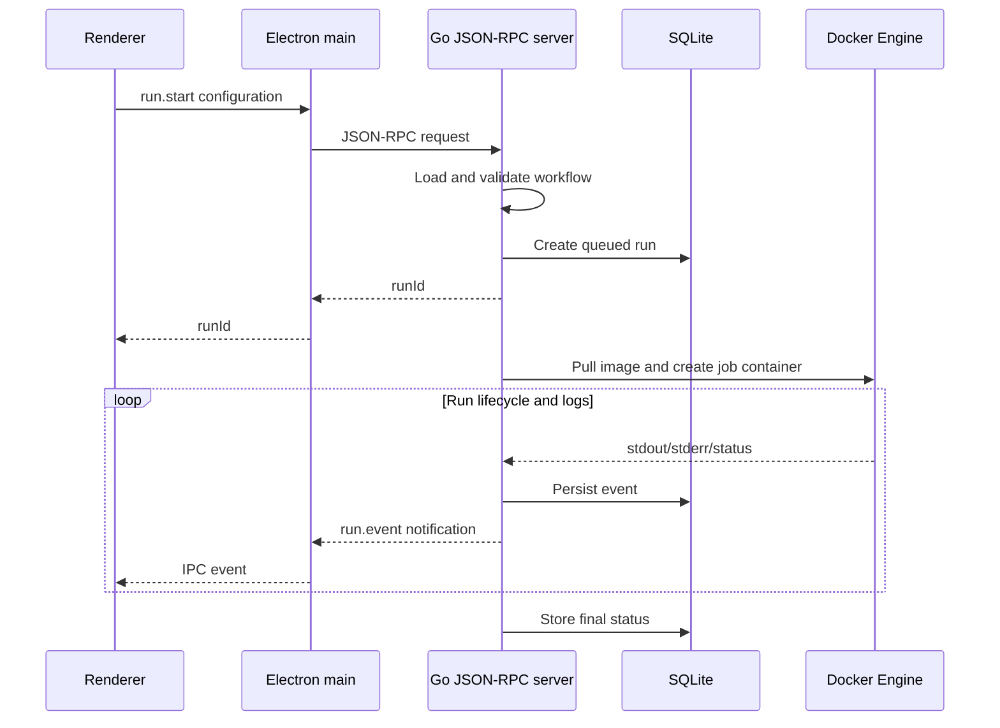

# Architecture

Piper consists of an Electron desktop application and a Go sidecar engine. The renderer never receives Node.js or filesystem access directly; Electron's preload layer exposes a narrow IPC bridge, and the main process owns the engine subprocess.



## Desktop application

The desktop app lives in `apps/desktop` and uses Electron Forge, Vite, React, TypeScript, Monaco Editor, React Flow, xterm.js, Zustand, and TanStack Query.

### Renderer

The renderer is responsible for:

- Selecting and displaying a local repository path.
- Switching between GitHub, GitLab, and Azure providers.
- Listing discovered workflows.
- Rendering the job dependency graph.
- Showing job metadata, steps, raw YAML, validation, and feature support.
- Collecting local event, input, environment, and secret configuration.
- Starting and cancelling runs.
- Rendering live structured events in an xterm.js terminal.
- Listing recent run summaries for the selected repository.

Zustand holds the current repository, provider, workflow, job selection, active run ID, and in-memory event stream. TanStack Query owns request-backed data such as providers, workflows, workflow details, history, application information, and update status.

### Preload bridge

Context isolation is enabled and Node integration is disabled. The preload script exposes only:

- A repository directory picker.
- Generic engine requests.
- Application version information.
- Update checks and update download/open behavior.
- Revealing a stored artifact in the operating-system file manager.
- Subscription to engine events.

### Main process

The Electron main process:

1. Resolves and starts the Go engine.
2. Sends newline-delimited JSON-RPC requests over the engine's stdin.
3. Parses responses and notifications from stdout.
4. Forwards engine notifications to renderer windows over IPC.
5. Routes engine diagnostics from stderr to the Electron console.
6. Sets the desktop database path.
7. Owns GitHub Release update checks.
8. Broadcasts an `engine.exit` event to the renderer if the sidecar terminates.

In a packaged application, the engine is loaded from Electron resources. In development, Piper first looks for `engine/bin/piper-engine` and otherwise falls back to `go run ./cmd/daemon`.

## Go engine

The engine lives in `engine`. `cmd/daemon` starts the local JSON-RPC server, while `cmd/cli` is a small workflow-discovery utility.

Core packages:

- `internal/api`: request dispatch, asynchronous run management, cancellation, and notifications.
- `internal/pipeline/model`: provider-neutral workflows, jobs, steps, graphs, validation, and run records.
- `internal/pipeline/plan`: matrix expansion and provider-neutral executable job instances.
- `internal/scheduler`: dependency-aware bounded parallel scheduling.
- `internal/expression`: provider-aware condition parsing, evaluation, and interpolation.
- `internal/pipeline/graph`: logical and expanded graph construction.
- `internal/pipeline/validation`: blocking validation and feature support classification.
- `internal/providers/github`: GitHub Actions discovery and parsing.
- `internal/providers/gitlab`: GitLab CI/CD discovery and parsing.
- `internal/providers/azure`: Azure Pipelines discovery and parsing.
- `internal/providers/yamlutil`: shared YAML node helpers.
- `internal/executor/docker`: Docker connection, image selection, containers, shell execution, and event streaming.
- `internal/actions`, `internal/artifacts`, `internal/caches`, and `internal/workspace`: local action resolution and managed execution data.
- `internal/persistence`: SQLite run and event persistence.
- `internal/logs`: structured run-event types.
- `internal/secrets`: exact-value log masking.

## Provider contract

Providers map their YAML format into a common model:

```go
type Provider interface {
    ID() ProviderID
    Discover(ctx context.Context, repoPath string) ([]WorkflowSummary, error)
    Load(ctx context.Context, repoPath, workflowPath string) (*Workflow, []byte, error)
    Validate(ctx context.Context, workflow *Workflow) ValidationReport
}
```

The neutral model allows the renderer, graph builder, validator, executor, and persistence layer to work without provider-specific branches except where execution semantics require one.

## Request and event flow



`run.start` is asynchronous. The request returns a run ID after validation and persistence; execution continues in a goroutine. A cancellation request invokes the run's `context.CancelFunc`, and the Docker executor kills the active job container if a step is running.

## Execution model

The local executor deliberately favors understandable behavior over broad emulation:

1. Load and validate the selected workflow.
2. Persist a queued run.
3. Emit compatibility notices for partial and unsupported features.
4. Connect to Docker using `DOCKER_HOST`, the active Docker context, the default endpoint, or known local socket paths.
5. Compile logical jobs into matrix-expanded execution instances.
6. Schedule dependency-ready jobs within the configured concurrency limit.
7. Evaluate job conditions and create an isolated Docker network/workspace.
8. Start service containers and wait until they report ready, honoring image health checks when defined, then start the job container.
9. Evaluate and execute each step, capturing outputs and structured status events.
10. Publish local artifacts/caches and clean up all containers and networks.
11. Aggregate deterministic final status and persist the run.

One container is shared by all steps in a job instance. Independent job instances may run concurrently and never share containers or service networks.

## Persistence

SQLite stores:

- Run identity and configuration metadata.
- Provider, workflow, optional selected job, event name, status, and timestamps.
- Ordered structured events, including logs and compatibility notices.

The desktop main process supplies `PIPER_DB`, normally pointing to Electron's user-data directory. A standalone engine defaults to `~/.piper/piper.db`.

The current renderer requests the 25 newest run summaries for the open repository. Events are persisted for future use, although the current UI does not reopen an old event stream.

## Update architecture

The update service is owned by the Electron main process and supports macOS, Windows, and Linux release installers:

1. Read `apps/desktop/update-config.json` from application resources.
2. Query the configured GitHub latest-release API.
3. Compare semantic versions.
4. Select the platform package matching `process.platform` and `process.arch`.
5. Download the installer and optional `.sha256` file.
6. Verify SHA-256 when a checksum is available.
7. Move the installer to the user's Downloads directory and open it.

The app does not silently replace itself. Private repositories can provide `PIPER_UPDATE_TOKEN` when launching Piper.

## Security boundaries

- The renderer is isolated from Node.js.
- Engine access is local stdio rather than a listening network service.
- Workflow code is not sandboxed from the mounted repository.
- Each job runs on a dedicated Piper-managed Docker network. Deployment jobs and runs configured with `disabled` or `internal` network access use an internal-only network with no external egress, though co-located service containers stay reachable.
- Supplied secrets are environment variables and exact-value log masking is best-effort.
- The repository path and workflow YAML should be treated as trusted input before execution.

See the [Engine API](engine-api.md) for protocol details and the [Provider Support Reference](provider-support.md) for behavior at the YAML-feature level.
